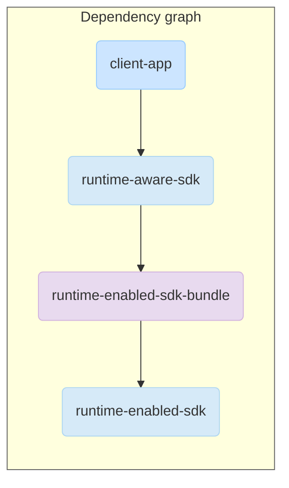

# SDK Runtime Sample App

This project provides a minimal, foundational template for developers looking to build a **Runtime-Enabled (RE) SDK**. 
It demonstrates the fundamental architecture and communication patterns between a client application and an SDK running in the SDK Runtime.

This starter project uses the recommended **Wrapper Pattern**, where a client-facing
**Runtime-Aware (RA) SDK** acts as a "shim" or wrapper around the core logic, which has been moved
into the sandboxed **Runtime-Enabled (RE) SDK**. This approach allows for a phased migration with
minimal disruption to apps consuming this SDK.

## Key concepts

For each app, there is one SDK Runtime process with a defined set of permissions and restrictions.

SDKs running inside this process are called **Runtime-Enabled SDKs**, or RE SDKs for short.

SDK developers can choose to build a translation SDK to help apps with migration.
These SDKs, which are aware of the SDK Runtime and interact with it, are called **Runtime Aware**, or RA SDKs.

Learn more about building RE SDKs in the [SDK development guide](https://privacysandbox.google.com/private-advertising/sdk-runtime/developer-guide).

Migrating to the SDK Runtime involves splitting your SDK into two modules that work
together across a secure process boundary.

* **Runtime-Enabled (RE) SDK**: This is your sandboxed code. 
  * It contains your core SDK logic and runs in a separate, isolated process with a restricted set of permissions.
* **Runtime-Aware (RA) SDK**: This is the new client-facing library that app developers integrate. 
  * It acts as a smart proxy, handling all the cross-process communication with the RE SDK,
  * making it invisible to app developers.

## Project structure

This project is divided into the key modules required for the wrapper pattern.



* **client-app**:
    * A minimal Android application that acts as the client consuming the SDK.
    * It demonstrates how to initialize the RA SDK and invoke its functions for data processing and displaying remote UI.
* **runtime-aware-sdk**:
    * The wrapper SDK that the client-app directly depends on.
    * It provides the public API surface and handles loading the runtime-enabled-sdk into the sandbox.
    * It also contains the `RemoteUiLayout class`, which manages rendering the sandboxed UI via a `SandboxedSdkView`.
* **runtime-enabled-sdk**:
    * The core SDK logic designed to run in the sandboxed SDK Runtime.
    * It implements the actual functionality, such as creating a file in sandboxed storage and providing a UI for the client app to display.
* **runtime-enabled-sdk-bundle**:
    * An [Android SDK Bundle (ASB)](https://developer.android.com/studio/command-line/bundletool#asb-format) module.
    * It defines the Runtime-Enabled SDK’s metadata, such as the package name used for loading the RE SDK in the Runtime, or defining its entry point.
    * It also packages the runtime-enabled-sdk into the required format for publication.

## Features

This starter project provides clear examples of the most common migration patterns you'll need.

* **SDK Loading**: See `RuntimeAwareSdk.kt` for how the RA SDK uses the `SdkSandboxManagerCompat` to load the RE SDK into the sandbox on-demand.
* **Data-In, Data-Out API**: The createFile method shows how to call a sandboxed method with simple parameters (`Long`) and get a simple result (`String`) back. This is the most straightforward pattern.
* **Remote UI (Banners/Views)**:
    * The `RemoteUiLayout` class demonstrates the **`SandboxedUiAdapter` pattern**.
    * The RE SDK creates a view and wraps it in a `SdkSandboxedUiAdapterImpl`.
    * The RA SDK receives this adapter and uses it with a `SandboxedSdkView` to securely render the UI in the client app's layout, without giving the sandbox direct access to the app's UI hierarchy or vice versa.
* **Cross-Process Callbacks**:
    * The `RemoteUiCallbackInterface` demonstrates the use of the **`@PrivacySandboxCallback` annotation**.
    * The client app (via the RA SDK) implements this interface and passes it to the RE SDK.
    * The RE SDK can then invoke methods on this interface to trigger actions back in the app's process, as seen when the button in the remote UI is clicked.

## Run the sample app

The following section explains how to prepare your environment to launch the sample app, and debug code that executes in the SDK Runtime.

### Set up your dev environment

Make sure you have upgraded to the latest version of Android Studio.

- Help menu > Find action > Type "Check for updates"

Depending on the Android version of your device or emulator, the sample Runtime-Enabled SDKs will either run on the SDK Runtime process, or statically linked to the app in backward compatible mode, transparently.

To get SDKs to run in the SDK Runtime, you'll need to be on Android 14 or higher.

#### Enable the SDK Runtime on a physical device

While the SDK Runtime is available in all GMS devices with Android 14 or higher, it's behind a configuration flag.

To enable it, you can run the following commands:

```shell
adb shell device_config put adservices global_kill_switch false
adb shell device_config put adservices disable_sdk_sandbox false
```

This isn't necessary on emulators.

### Launch and use the client app

- Open the sample app project in Android Studio.
- Press the Run button to install the SDKs and launch the client app.
- Click Initialize SDK. A toast should show that SDK loaded successfully.
- Click Show Banner View. A banner rendered by the SDK will be
  displayed. If you click it, an Activity customized by the SDK will be launched.

For more information, read the [documentation](https://privacysandbox.google.com/private-advertising/sdk-runtime).

## Debug the sample app

You can debug your client-side app as usual, but there is one more thing to do if you need to debug code in any of the Runtime-Enabled SDKs.

### Debug the runtime-enabled code

As RE SDKs run in a different process than the test app, you have to configure Android Studio to attach a debugger to the SDK Runtime process.

Otherwise, breakpoints in any of the RE SDKs won't work, failing silently.

You can configure Android Studio to attach a debugger to the SDK Runtime process when debugging the app.
For this, the SDK Runtime process has to be already running. If you need to debug the initialization of an RE SDK, and the SDK Runtime process, read the following section.

To attach a debugger to the SDKRT process, you have to:

- In the Run menu, click **Attach debugger to Android Process**.
- Select **Show all processes**.
- Find a process called `<CLIENT_APP_PROCESS>_sdk_sandbox`. In this case, it will be called `com.example.privacysandbox.client_sdk_sandbox`.
- Select `com.example.privacysandbox.client_sdk_sandbox`, and click **OK**.

**Note that** to be able to debug the SDK Runtime process, the client app has to be debuggable. Building with the debug variant should suffice.

### Debug initialization of the runtime-enable code

Since the previous instructions require the SDK Runtime process to be already running, if you want to debug the initialization method, you'll have to start the app's SDK Runtime process manually first.

To start the SDK Runtime process:

- Ensure the client app is already running.
- In the terminal, enter the following commands:
- `adb shell cmd deviceidle tempwhitelist com.example.privacysandbox.client`
- `adb shell cmd sdk_sandbox start com.example.privacysandbox.client`
- In the **Run** menu, click **Attach debugger to Android Process**.

Once you have started the SDK Runtime process, will be able to attach a debugger to it, and debug any breakpoints in the initialization method:

- Select `com.example.privacysandbox.client_sdk_sandbox` and click **OK**.
- Click Initialize SDK in the app.